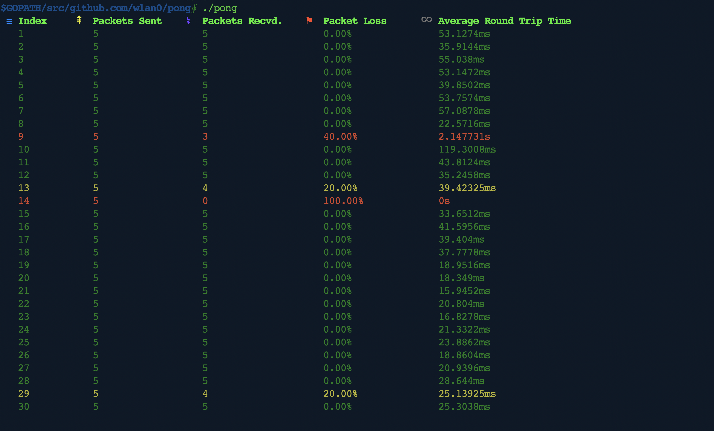

Pong
------

Pong is a command line tool which summarizes the connectivity of your internet connection.

The well known `ping` utility ends up priting too many lines if kept running long. The format of `ping` output also makes it hard to view connectivity during a particular window of time. `Pong` summarizes the connectivity of the network as shown in this picture:

Pong runs tests in intervals of 5 second each, each test sending 5 packets. This is to ensure that output is ready to be viewed relatively quickly.

Pong maintains a circular buffer of the last 30 tests, to show the connectivity during a 5 minute window. 

I created this to test my Wifi